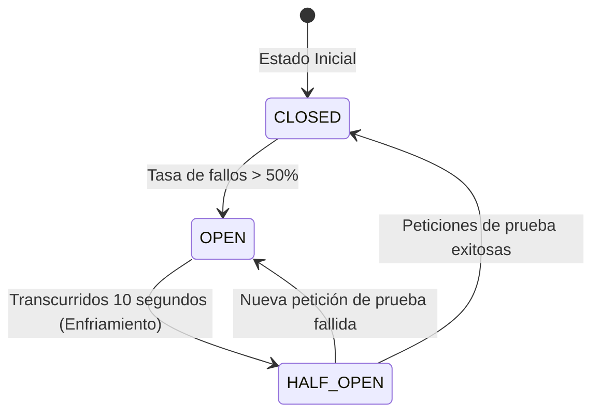
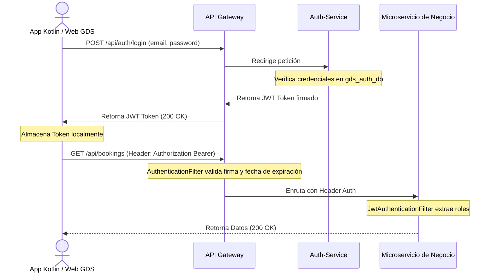
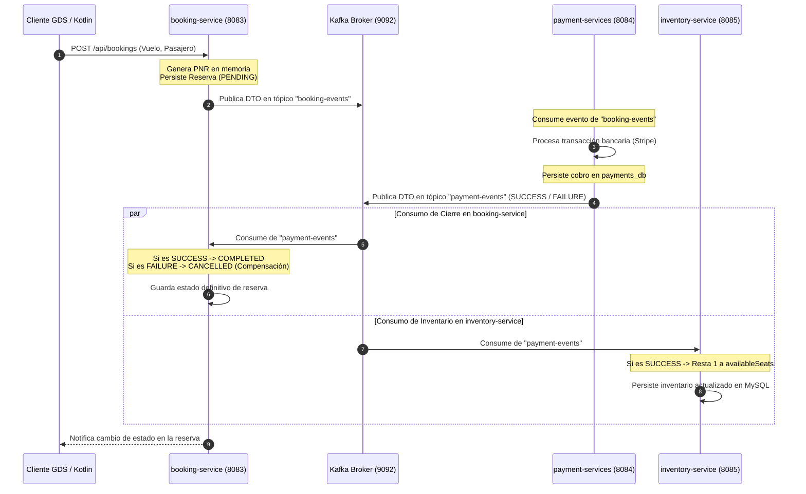

# Especificación Técnica Consolidada: SkyLink GDS (Fases 1 a 10)

Este documento consolidado sirve como la **fuente de verdad técnica** para la arquitectura, el diseño de infraestructura, los flujos transaccionales asíncronos y la especificación de interfaces de la plataforma **SkyLink GDS**. Está estructurado especialmente para su análisis en **NotebookLM** y como guía de referencia para el desarrollo futuro de la aplicación móvil nativa en **Kotlin** para pasajeros.

---

## 1. Arquitectura del GDS y Core de Infraestructura

SkyLink GDS adopta una arquitectura de microservicios distribuidos desacoplados bajo el patrón **Database-per-Service** para garantizar el aislamiento de fallos y la scalabilidad independiente.

### 1.1 Diagrama de Arquitectura del Ecosistema

```mermaid
graph TD
    Client[Aplicación Cliente / Futura App Kotlin] -->|Puerto 8080| Gateway[API Gateway - Spring Cloud Gateway]
    
    subgraph Servidores de Soporte GDS
        Config[Config Server - Puerto 8888]
        Eureka[Discovery Server Eureka - Puerto 8761]
    end
    
    subgraph Observabilidad
        Zipkin[Zipkin Server - Puerto 9411]
        Prometheus[Prometheus Server - Puerto 9090]
        Grafana[Grafana Dashboard - Puerto 3000]
    end
    
    subgraph Microservicios de Negocio
        Auth[auth-service - Puerto 8081] --> DB_Auth[(gds_auth_db)]
        Flight[flight-service - Puerto 8082] --> DB_Flight[(flights_db)]
        Booking[booking-service - Puerto 8083] --> DB_Booking[(bookings_db)]
        Payment[payment-service - Puerto 8084] --> DB_Payment[(payments_db)]
        Inventory[inventory-service - Puerto 8085] --> DB_Inventory[(inventory_db)]
        Agency[agency-service - Puerto 8086] --> DB_Agency[(agency_db)]
    end

    Gateway -->|Enrutamiento Dinámico lb://| Eureka
    Gateway -->|Circuit Breaker / Rate Limiting| Auth
    Gateway -->|Circuit Breaker / Rate Limiting| Flight
    Gateway -->|Circuit Breaker / Rate Limiting| Booking
    Gateway -->|Circuit Breaker / Rate Limiting| Payment
    Gateway -->|Circuit Breaker / Rate Limiting| Inventory
    Gateway -->|Circuit Breaker / Rate Limiting| Agency
    
    Microservicios de Negocio -.->|Lectura de Propiedades| Config
    Microservicios de Negocio -.->|Registro y Health Checks| Eureka
    Microservicios de Negocio -.->|Trazas Micrometer| Zipkin
    Microservicios de Negocio -.->|Métricas Actuator| Prometheus
    Prometheus --> Grafana
```

### 1.2 Servidores de Configuración y Descubrimiento
- **Config Server (Puerto `8888`)**: Centraliza todas las variables de entorno y archivos de configuración YAML en un repositorio local de configuración. Los servicios cargan sus propiedades al arrancar de forma opcional (`optional:configserver:http://localhost:8888`).
- **Discovery Server Eureka (Puerto `8761`)**: Actúa como registro de servicios. Los microservicios se descubren dinámicamente utilizando el prefijo de abstracción `lb://` en lugar de direcciones IP físicas.

### 1.3 Pasarela de Enlace (API Gateway - Puerto `8080`)
Construida sobre **Spring Cloud Gateway (Reactivo/WebFlux)**, actúa como el único punto de entrada perimetral público del clúster.

#### A. Enrutamiento Dinámico y Filtros
El gateway intercepta el tráfico exterior y aplica reglas centralizadas:
- **Resilience4j Circuit Breaker**: Protege al clúster de caídas en cascada aislando servicios lentos o caídos en base a tres estados:
  - `CLOSED`: Las peticiones fluyen normalmente.
  - `OPEN`: Si la tasa de fallos supera el 50% en una ventana determinada, la petición se desvía instantáneamente a un endpoint de `fallback` en `FallbackController.java` retornando `HTTP 503 Service Unavailable`.
  - `HALF-OPEN`: Tras 10 segundos de enfriamiento, deja pasar peticiones de prueba para evaluar la recuperación del servicio.
- **Control de Tráfico Dinámico (Rate Limiter con Redis)**: Implementa el algoritmo **Token Bucket** respaldado por Redis para prevenir ataques de denegación de servicio (DDoS) o raspado agresivo (Scraping).
  - Configuración: `replenishRate: 1` (añade 1 token por segundo), `burstCapacity: 2` (capacidad máxima del balde). Si se excede, retorna inmediatamente `HTTP 429 Too Many Requests`.



#### B. Componente KeyResolver (`RateLimiterConfig.java`)
Mapea de manera reactiva la dirección IP de origen de la petición cliente:
```java
@Configuration
public class RateLimiterConfig {
    @Bean
    public KeyResolver userKeyResolver() {
        return exchange -> Mono.just(
            Objects.requireNonNull(exchange.getRequest().getRemoteAddress()).getAddress().getHostAddress()
        );
    }
}
```

#### C. Hoja de Rutas Unificada (`api-gateway.yaml`)
```yaml
spring:
  cloud:
    gateway:
      routes:
        - id: auth-service-route
          uri: lb://AUTH-SERVICE
          predicates:
            - Path=/api/auth/**
        - id: flight-service
          uri: lb://FLIGHT-SERVICE
          predicates:
            - Path=/api/flights/**
          filters:
            - name: CircuitBreaker
              args:
                name: flightCircuitBreaker
                fallbackUri: forward:/fallback/flights
        - id: booking-service
          uri: lb://BOOKING-SERVICE
          predicates:
            - Path=/api/bookings/**
          filters:
            - name: AuthenticationFilter
            - name: CircuitBreaker
              args:
                name: bookingCircuitBreaker
                fallbackUri: forward:/fallback/booking
            - name: RequestRateLimiter
              args:
                redis-rate-limiter.replenishRate: 1
                redis-rate-limiter.burstCapacity: 2
                redis-rate-limiter.requestedTokens: 1
```

### 1.4 Infraestructura de Observabilidad
- **Trazabilidad con Zipkin (Puerto `9411`)**: A través del puente de Brave y Micrometer, inyecta un `Trace ID` único global y un `Span ID` por cada tramo a las cabeceras HTTP y a los hilos de ejecución de la Saga.
- **Métricas con Prometheus (Puerto `9090`)**: Hace raspado (*scraping*) continuo en `/actuator/prometheus` cada 5 segundos.
- **Visualización en Grafana (Puerto `3000`)**: Conectado directamente a Prometheus. Utiliza el panel de telemetría de última generación `ID: 19004` (Spring Boot 3.x Prom Micrometer) para monitorizar:
  - Uso de Memoria JVM (`jvm_memory_used_bytes`).
  - Frecuencia de Peticiones (`http_server_requests_seconds_count`).
  - Latencia Media (`http_server_requests_seconds_max`).
  - Hilos Activos (`jvm_threads_live_threads`).

---

## 2. Seguridad Perimetral y Autenticación Zero-Trust

La plataforma opera bajo un modelo **Zero-Trust (Confianza Cero)**. La verificación de la identidad se realiza en el API Gateway y es propagada hacia los microservicios internos.



### 2.1 Backend: Auth-Service (`auth-service`)
Se encarga de la persistencia de los perfiles de usuario y agencias en la base de datos `gds_auth_db`. Las contraseñas se almacenan de forma segura utilizando el algoritmo **BCrypt** de hashing.
- **Clave Secreta Centralizada (JWT)**: `AirlinesGdsSystemSecretKeyForJwtAuthenticationSuperSecure` (definida en el servidor de configuración centralizado).

### 2.2 Filtro de Autenticación Reactivo (`AuthenticationFilter.java`)
Implementado en el Edge (Gateway), intercepta de forma asíncrona las solicitudes entrantes y comprueba la cabecera `Authorization`:
```java
@Component
public class AuthenticationFilter extends AbstractGatewayFilterFactory<AuthenticationFilter.Config> {
    private final JwtUtil jwtUtil;

    public AuthenticationFilter(JwtUtil jwtUtil) {
        super(Config.class);
        this.jwtUtil = jwtUtil;
    }

    @Override
    public GatewayFilter apply(Config config) {
        return (exchange, chain) -> {
            if (!exchange.getRequest().getHeaders().containsKey(HttpHeaders.AUTHORIZATION)) {
                exchange.getResponse().setStatusCode(HttpStatus.UNAUTHORIZED);
                return exchange.getResponse().setComplete();
            }
            String authHeader = Objects.requireNonNull(exchange.getRequest().getHeaders().get(HttpHeaders.AUTHORIZATION)).getFirst();
            if (authHeader != null && authHeader.startsWith("Bearer ")) {
                authHeader = authHeader.substring(7);
            } else {
                exchange.getResponse().setStatusCode(HttpStatus.UNAUTHORIZED);
                return exchange.getResponse().setComplete();
            }
            try {
                jwtUtil.validateToken(authHeader);
            } catch (Exception e) {
                exchange.getResponse().setStatusCode(HttpStatus.UNAUTHORIZED);
                return exchange.getResponse().setComplete();
            }
            return chain.filter(exchange);
        };
    }
    public static class Config {}
}
```

### 2.3 Manejo Global de Resiliencia de Seguridad
Cada microservicio de negocio cuenta con un `@RestControllerAdvice` (`GlobalExceptionHandler.java`) para interceptar fallos del ecosistema. En caso de fallar la autenticación de credenciales, intercepta `BadCredentialsException` y devuelve un código controlado `HTTP 401 Unauthorized`.

---

## 3. Feature: Vuelos (`flight-service`)

Administra las aerolíneas, las rutas de vuelo activas, los horarios de salida y llegada y los precios base del pasaje.

### 3.1 Backend: Microservicio `flight-service`
- **Puerto**: `8082`
- **Base de Datos**: `flights_db`

#### A. Modelo de Datos (`Flight.java`)
Mapea la disponibilidad y asignación del vuelo básico:
- `id` (Long, PK): Identificador secuencial autogenerado.
- `flightNumber` (String): Código identificativo del vuelo (ej. *SL-402*, *MAD-101*).
- `origin` (String): Código IATA de 3 letras del aeropuerto de salida (ej. *MAD*).
- `destination` (String): Código IATA de 3 letras del aeropuerto de llegada (ej. *JFK*).
- `departureTime` (LocalDateTime): Fecha y hora de salida programada.
- `arrivalTime` (LocalDateTime): Fecha y hora de llegada estimada.
- `price` (Double): Precio base del pasaje en dólares.
- `availableSeats` (Integer): Total de asientos en cabina (150 o 180 por defecto).

#### B. Endpoints Públicos / Internos
Expuestos bajo la ruta `/api/flights/**`:

| Método | Endpoint | Descripción | Seguridad |
|---|---|---|---|
| `GET` | `/api/flights` | Obtiene el catálogo completo de vuelos. | Permitido a usuarios autenticados. |
| `GET` | `/api/flights/{id}` | Recupera la información de un itinerario específico. | Permitido a usuarios autenticados. |
| `POST` | `/api/flights` | Crea y programa una nueva ruta de vuelo. | Exclusivo para administradores/aerolíneas. |

#### C. Lógica de Estados Derivados de Negocio
Para evitar guardar estados transitorios en la base de datos, el estado del vuelo (*Cancelled*, *Delayed*, *On-Time*) se calcula dinámicamente a partir de la codificación de su número de vuelo:
- **Cancelled**: Si la suma de los valores ASCII del código del vuelo es divisible por `9`.
- **Delayed**: Si es divisible por `6`.
- **On-Time**: Por defecto.

### 3.2 Frontend: Módulo de Itinerarios (`Flights`)
- **Ruta**: `src/app/pages/flights/`
- **Métricas Bento Grid**:
  - *Rutas Activas*: Suma de pares origen-destino únicos programados.
  - *Vuelos Hoy*: Cantidad de vuelos cuya salida coincide con la fecha de la máquina del cliente.
  - *OTP (On-Time Performance)*: Porcentaje acumulado de vuelos con estado derivado de *On-Time*.
- **Filtros Avanzados**: Categorización interactiva por estados (`ALL`, `IN_AIR` [salida pasada, llegada futura], `DELAYED`).
- **Modal de Programación**: Formulario reactivo de Angular para inyectar nuevos vuelos en tiempo real.

---

## 4. Feature: Agencias (`agency-service`)

Aísla el dominio operativo y el directorio de agencias de viajes asociadas al GDS, controlando su nivel de compliance y volumen de facturación.

### 4.1 Backend: Microservicio `agency-service`
- **Puerto**: `8086`
- **Base de Datos**: `agency_db`

#### A. Modelo de Datos (`Agency.java`)
- `id` (Long, PK): Identificador único secuencial.
- `agencyName` (String): Nombre comercial registrado.
- `iataCode` (String): Código único de acreditación IATA de 7 dígitos.
- `city` / `country` (String): Ubicación geográfica corporativa.
- `region` (Enum): `EMEA`, `APAC`, `AMER`.
- `contactName` / `contactEmail` (String): Datos del administrador.
- `status` (Enum): Estado operativo de venta (`ACTIVE` o `SUSPENDED`).
- `bookings30d` (Integer): Cantidad acumulada de reservas creadas en los últimos 30 días.
- `complianceRate` (Double): Porcentaje de cumplimiento normativo financiero.

#### B. Endpoints REST de Agencias

| Método | Endpoint | Parámetros de Consulta | Descripción |
|---|---|---|---|
| `GET` | `/api/agencies` | `page`, `size`, `search`, `status`, `region` | Recupera la lista paginada y filtrable. |
| `GET` | `/api/agencies/{id}` | Ninguno | Detalle individual de la agencia. |
| `POST` | `/api/agencies` | Body: `AgencyRequest` | Registra una nueva agencia asociada. |
| `PUT` | `/api/agencies/{id}` | Body: `AgencyRequest` | Actualiza la información operativa. |
| `DELETE` | `/api/agencies/{id}` | Ninguno | Elimina la agencia del registro. |
| `GET` | `/api/agencies/metrics` | Ninguno | KPI Cards consolidados del clúster. |
| `GET` | `/api/agencies/top-performers` | Ninguno | Lista ordenada por mayor cantidad de reservas. |

### 4.2 Frontend: Panel de Control de Agencias (`Agencies`)
- **Dashboard Bento Grid**: Muestra KPI Cards con marcas de agua escaladas en un 50% (`225px`) para optimizar el peso visual.
- **Tabla Paginada**: Visualiza el avatar de la agencia con contraste dinámico, barra de progreso para la cuota de reservas y pills de estado (`ACTIVE` en verde, `SUSPENDED` en rojo).
- **Modal de Reporte de Ranking de Rendimiento**:
  - Incorpora estilo premium con Glassmorphism (desenfoque de fondo y bordes finos translúcidos).
  - Presenta un desglose interactivo regional (agencias activas, reservas totales, cumplimiento promedio de EMEA, APAC y AMER).
  - Leaderboard global interactivo que permite reordenar dinámicamente las columnas y asigna medallas visuales de **Oro, Plata y Bronce** al Top 3 de agencias por rendimiento.

---

## 5. Feature: Reservas (`booking-service`)

Es el motor transaccional del sistema. Actúa como el orquestador principal del ciclo de vida de la compra de billetes de avión y realiza la agregación de datos mediante API Composition.

### 5.1 Backend: Microservicio `booking-service`
- **Puerto**: `8083`
- **Base de Datos**: `bookings_db`

#### A. Modelo de Datos (`Reservation.java`)
```java
@Entity
@Table(name = "reservations")
@Data
@Builder
@NoArgsConstructor
@AllArgsConstructor
public class Reservation {
    @Id
    @GeneratedValue(strategy = GenerationType.IDENTITY)
    private Long id;

    @Column(nullable = false, unique = true, length = 6)
    private String pnr; // Passenger Name Record alfanumérico generado en backend (ej: X7B9Q2)

    @Column(nullable = false)
    private Long userId; // Guardamos ID de usuario de forma desacoplada

    @Column(nullable = false)
    private Long scheduleId; // ID del itinerario de vuelos en flight-service

    @Column(nullable = false)
    private BigDecimal totalAmount;

    @Enumerated(EnumType.STRING)
    @Column(nullable = false)
    private PaymentStatus status; // PENDING, COMPLETED, FAILED, CANCELLED

    @org.hibernate.annotations.CreationTimestamp
    @Column(updatable = false)
    private java.time.LocalDateTime createdAt;
}
```

#### B. API Composition y OpenFeign (`AdminBookingService.java`)
Para mantener el acoplamiento débil entre microservicios sin realizar JOINs directos entre bases de datos, el `booking-service` realiza una composición de datos en memoria consumiendo las APIs de `auth-service` y `flight-service` de forma transparente utilizando **Spring Cloud OpenFeign**:

```mermaid
graph TD
    BookingService[booking-service] -->|OpenFeign: AuthClient| AuthService[auth-service]
    BookingService -->|OpenFeign: FlightClient| FlightService[flight-service]
    Note over BookingService: Cruza PNR con email de usuario y origen/destino del vuelo.
```

- **Llamada de Composición**:
```java
// AuthClient.java
@FeignClient(name = "AUTH-SERVICE")
public interface AuthClient {
    @GetMapping("/api/auth/users/{id}/email")
    String getUserEmailById(@PathVariable("id") Long id);
}

// FlightClient.java
@FeignClient(name = "FLIGHT-SERVICE")
public interface FlightClient {
    @GetMapping("/api/flights/{id}")
    Map<String, Object> getFlightInfo(@PathVariable("id") Long id);
}
```
Si un microservicio externo no está disponible durante la composición de la tabla, la lógica implementa bloques `try-catch` para asignar un valor de degradación elegante (`"Email no disponible"` o `"N/A"`) para mantener el dashboard del operador activo.

#### C. Delegación Matemática a Base de Datos
Para evitar desbordamientos de memoria en la máquina virtual (JVM OOM) al procesar miles de registros de transacciones, los KPIs del Dashboard no se computan en la memoria de Java, sino que se delegan en el motor relacional de MySQL mediante consultas directas:
- **Sumas e Indicadores de Éxito**: Consultas `JPQL` simples (`COUNT`, `SUM`).
- **Agrupación Temporal de Gráficas**: Consultas nativas SQL con funciones del motor relacional (`DATE(created_at)`) y sentencias seguras `COALESCE` para evitar excepciones por valores nulos:
```java
@Query("SELECT COALESCE(SUM(r.totalAmount), 0) FROM Reservation r WHERE r.status = :status")
BigDecimal sumTotalAmountByStatus(@Param("status") PaymentStatus status);
```

#### D. Endpoints Expuestos de Reservas

| Método | Endpoint | Parámetros de Consulta | Descripción |
|---|---|---|---|
| `POST` | `/api/bookings` | Body: `Reservation` | Crea la reserva inicial en estado `PENDING` e inicia la Saga de pagos. |
| `GET` | `/api/bookings/admin/dashboard/recent` | `page`, `size`, `pnr`, `status` | Retorna las reservas paginadas cruzadas por API Composition. |
| `GET` | `/api/bookings/admin/dashboard/kpis` | Ninguno | KPIs consolidados: facturación total, recuento y tasa de éxito (%). |
| `GET` | `/api/bookings/admin/dashboard/charts` | Ninguno | Historial diario y distribución de estados para renderizado. |

---

## 6. Feature: Pagos (`payment-services`)

Verifica la validez financiera de la transacción emitiendo cobros ficticios hacia una pasarela bancaria.

### 6.1 Backend: Microservicio `payment-services`
- **Puerto**: `8084`
- **Base de Datos**: `payments_db`
- **Operatividad**: Servicio puramente asíncrono controlado por eventos que no expone endpoints REST públicos para clientes. Consume mensajes del tópico de Kafka `booking-events` y emite veredictos de confirmación o fallo en el tópico `payment-events`.

#### A. Modelo de Datos (`Payment.java`)
- `id` (Long, PK): Identificador único de transacción.
- `pnr` (String): Código PNR de 6 letras asociado.
- `amount` (BigDecimal): Monto cargado a la tarjeta.
- `paymentStatus` (String): Estado resultante (`SUCCESS` o `FAILED`).
- `transactionId` (String): Identificador único de pasarela simulado (con formato de Stripe `txn_...`).
- `createdAt` (LocalDateTime): Fecha y hora del cobro.

#### B. Simulación de Pasarela Bancaria (`PaymentProcessorService.java`)
Para posibilitar la simulación de transacciones compensatorias en la Saga:
- **Lógica del Mock**: El pago se procesará como exitoso (`SUCCESS`) para todos los usuarios, **excepto si el ID de usuario es `99`**, en cuyo caso la pasarela simulará la falta de fondos del cliente y retornará `FAILED` de forma inmediata.

---

## 7. Feature: Gestión de Inventario de Asientos (`inventory-service`)

Custodia el espacio físico de los aviones operacionales, evitando problemas severos de sobreventa mediante controles transaccionales reactivos.

### 7.1 Backend: Microservicio `inventory-service`
- **Puerto**: `8085`
- **Base de Datos**: `inventory_db`

#### A. Modelo de Datos (`Inventory.java`)
Mapea el desglose físico y la ocupación de asientos en tiempo real:
- `id` (Long, PK): Identificador de registro.
- `scheduleId` (Long, Unique): Identificador del vuelo en `flight-service`.
- `flightNumber` (String): Código de vuelo.
- `origin` / `destination` / `departureTime` / `baseFare`: Datos de vuelo cacheados.
- `status` (Enum): `ON_SALE`, `LIMITED`, `EARLY_BOOKING`, `CLOSED`.
- `availableSeats` (Integer): Asientos totales remanentes (capacidad total menos reservas de todas las cabinas).
- **Desglose de Cabinas** (Capacidad Máxima vs Asientos Reservados):
  - *Economy*: `economyTotal` / `economyBooked`
  - *Premium Economy*: `premiumTotal` / `premiumBooked`
  - *Business*: `businessTotal` / `businessBooked`
  - *First Class*: `firstTotal` / `firstBooked` (Admite valores nulos si el avión asignado carece de esta cabina).

#### B. Endpoints REST de Inventario

| Método | Endpoint | Parámetros de Consulta | Descripción |
|---|---|---|---|
| `GET` | `/api/inventories` | `page`, `size`, `search`, `status` | Catálogo paginado con el estado del inventario de la flota. |
| `GET` | `/api/inventories/{id}` | Ninguno | Recupera el detalle de un vuelo y sus cabinas. |
| `GET` | `/api/inventories/metrics` | Ninguno | KPIs: vuelos activos, promedios de Load Factor, valor no vendido. |
| `GET` | `/api/inventories/alerts` | Ninguno | Buzón de alarmas analíticas del clúster. |
| `PUT` | `/api/inventories/{id}` | Body: `InventoryUpdateRequest` | Ajuste manual de capacidades para analistas de ingresos. |

#### C. Lógica del Motor de Alertas Analíticas
- **Alerta Crítica (CRITICAL)**: Si en alguna cabina la cantidad de reservas supera el límite de asientos físicos del avión (`booked > total`), se emite una alerta de sobreventa severa recomendando pausar de forma inmediata el inventario.
- **Advertencia (WARNING)**: Si el factor de ocupación total supera el `90%`, se emite una recomendación de *Dynamic Pricing Surge* para incrementar automáticamente las tarifas base y mitigar la demanda.

### 7.2 Frontend: Panel de Control de Inventario (`InventoryComponent`)
- **Live Inventory Grid**: Muestra las cabinas en una cuadrícula compacta. Cada clase de boleto cuenta con una barra de progreso que adopta colores dinámicos: verde para baja ocupación (`<50%`), amarilla para ocupación en progreso (`50% - 80%`) y roja para ocupaciones críticas (`>80%`).
- **Yield Chart (Proyección de Rendimiento)**: Gráfico de columnas que estima la ocupación en las próximas 24 horas y proporciona tooltips interactivos.
  - *Corrección de Renderizado CSS (Flexbox Height Fix)*: Se solventó un error visual donde las columnas del gráfico colapsaban a `0px` de altura agregando al wrapper de la columna `.chart-bar-wrapper` una directiva de altura fija del 100% y centrado vertical inferior para anclar la barra a su base:
  ```scss
  .chart-bar-wrapper {
      height: 100%;
      display: flex;
      flex-direction: column;
      justify-content: flex-end;
  }
  ```

---

## 8. Orquestación de Saga Coreografiada y Prevención de Poison Pill

Para garantizar la consistencia eventual entre microservicios sin bloqueos de bases de datos distribuidas ni cuellos de botella síncronos, se implementa el patrón **Saga Coreografiada** mediante un bus de eventos con **Apache Kafka** en el puerto `9092`.

### 8.1 Flujo Transaccional End-to-End de Compra de Pasajes



### 8.2 Detalles de los Tópicos de Kafka

| Nombre de Tópico | Productor | Consumidores | DTO de Red |
|---|---|---|---|
| `booking-events` | `booking-service` | `payment-services` | `BookingCreatedEvent` |
| `payment-events` | `payment-services` | `booking-service`, `inventory-service` | `PaymentResultEvent` |

### 8.3 Prevención de la "Píldora Envenenada" (Poison Pill)
Al iniciar servicios de negocio y deserializar payloads JSON en entornos con diferentes versiones de paquetes, las clases compartidas de Java pueden lanzar excepciones de tipo `ClassNotFoundException` si se inyectan metadatos de rutas internas en las cabeceras tipadas.
Para evitar que un mensaje mal estructurado bloquee indefinidamente las colas de mensajería (Poison Pill), se configuraron las siguientes políticas estrictas de deserialización en las propiedades centralizadas de los consumidores Kafka:

1. **Ignorar Cabeceras de Paquetes**: `spring.json.use.type.headers: false` evita que Kafka intente instanciar la clase exacta usando la ruta de paquetes del microservicio de origen.
2. **Definir DTO de Fallback Local**: `spring.json.value.default.type` mapea el JSON de entrada directamente a la ruta de la clase DTO declarada localmente en las fronteras físicas del microservicio receptor.
3. **Confianza de Paquetes**: `spring.json.trusted.packages: "*"` permite deserializar payloads JSON provenientes de cualquier origen.
4. **Desacoplamiento Absoluto de Eventos**: Cada microservicio define de forma autónoma su propia clase DTO del evento, impidiendo dependencias directas o importación cruzada de paquetes entre proyectos.

---

## 9. Tokens de Diseño SCSS e Interfaz de Usuario (Angular SPA)

Para el panel administrativo GDS se implementó una interfaz SPA basada en **Componentes Standalone** de **Angular 21** sin utilizar frameworks utilitarios como Tailwind CSS, siguiendo la arquitectura de estilos **SCSS BEM**.

### 9.1 Sistema de Variables CSS y SCSS Centralizado
Ubicado en `src/styles/_variables.scss` e inyectado globalmente en la configuración del preprocesador de `angular.json`:

```scss
// Capas y Superficies (Material Design 3)
$bg-canvas: #fcf8ff;                // Lienzo base de la aplicación
$surface-card: #ffffff;             // Fondo de módulos analíticos y tarjetas
$surface-container-low: #f6f1ff;    // Contenedores de bajo contraste (ej. caja de avatar)
$surface-container: #f0ebff;        // Fondo de inputs y barra lateral (Sidebar)
$surface-container-high: #ebe5ff;   // Resaltados y separadores estáticos

// Tipografía y Contraste (Fuente: Inter)
$on-surface: #322d56;               // Texto principal y títulos principales
$on-surface-variant: #5f5a86;       // Subtítulos y textos de soporte
$outline-variant: #b3acde;          // Bordes de inputs y líneas de división

// Paleta de Marca (Brand Colors)
$primary-indigo: #4f57aa;           // Color maestro de marca (botones, enlaces activos)
$primary-dim: #424b9d;              // Tono :hover y :active para botones
$on-primary: #fbf8ff;               // Contraste sobre color primario

// Alertas Semánticas de Negocio
$error: #ac3149;                    // Acciones destructivas y fallos transaccionales
$error-bg: rgba(172, 49, 73, 0.1);  // Fondos de banners de error
$tertiary-lime: #6c7f1b;            // Éxito semántico (Reserva confirmada, 2FA)
$tertiary-container: #dff685;       // Fondo para badges de estado exitosos
```

### 9.2 Reglas visuales estructuradas
- **Curvaturas de Borde Rígidas**: Botones e inputs corporativos tienen un borde redondeado de `4px` (`0.25rem`) para mantener la estética seria de software industrial. Las tarjetas de datos usan `12px`.
- **Alineación Rejilla Fluiva**: Se eliminaron los límites de ancho estáticos (`max-width: 1200px`) en páginas de configuración e inventario. El contenido fluye de manera natural en un **ancho fluido del 100%**, previniendo la aparición de márgenes asimétricos no deseados a la izquierda.

### 9.3 Control del Layout Fullscreen (Evitando el Parpadeo de Login)
Para evitar que el menú global lateral (`app-sidebar`) se renderice temporalmente en la pantalla de autenticación durante redirecciones asíncronas de Angular (`NavigationEnd`), el componente principal realiza una verificación síncrona en el milisegundo cero consumiendo el servicio de localización del navegador:

```typescript
@Component({
  selector: 'app-root',
  standalone: true,
  imports: [RouterOutlet, CommonModule, Sidebar],
  templateUrl: './app.html',
  styleUrl: './app.scss'
})
export class App {
  private location = inject(Location);

  get isFullscreenRoute(): boolean {
    const path = this.location.path();
    return path === '' || path.includes('/login');
  }
}
```
La plantilla `app.html` envuelve síncronamente el Sidebar:
```html
@if (!isFullscreenRoute) {
  <div class="app-layout">
    <app-sidebar></app-sidebar>
    <main class="main-content">
      <router-outlet></router-outlet>
    </main>
  </div>
} @else {
  <router-outlet></router-outlet>
}
```

---

## 10. Manual de Troubleshooting y Prácticas de Ingeniería Senior

Consolidación de las principales incidencias encontradas y resueltas durante el desarrollo de la plataforma:

### 10.1 Guía de Resolución de Incidencias Técnicas

| Incidencia | Causa Raíz | Solución Técnica |
|---|---|---|
| **Bucle de Errores Deserialización (Poison Pill)** | Cambios estructurales en el DTO de red hacen que Kafka reintente infinitamente consumir un mensaje binario incompatible. | Inyectar `ErrorHandlingDeserializer` en el archivo de configuración YAML o inhabilitar la lectura de cabeceras de clases específicas (`use.type.headers: false`). |
| **Conflicto de Puertos (3306)** | Instancias residuales de MySQL ejecutándose en local entran en colisión con el puerto del contenedor de Docker. | Localizar el PID del proceso utilizando el comando de red `netstat -ano \| findstr 3306` y forzar la finalización de la tarea. |
| **IllegalArgumentException (Enums)** | Discrepancia tipográfica entre el String JSON transportado por Kafka y el nombre del Enum local. | Asegurar consistencia mediante el método `Enum.valueOf()` rodeado de un bloque try-catch para un mapeo seguro. |
| **Fallo de DTO en Puerta de Enlace (HTTP 401)** | El formulario frontend envía credenciales bajo la propiedad `username` en lugar del campo `email` esperado por Spring Security. | Unificar el contrato del payload en `AuthService` mapeando explícitamente las credenciales a la clave `email`. |
| **Elemento Desconocido en Angular Standalone** | La etiqueta del Sidebar no es reconocida por el compilador (`ngtsc -998001`). | Importar explícitamente la clase del Sidebar en el array de `imports` del decorador `@Component` del componente raíz. |
| **Desplazamiento Vertical del Dashboard** | Los componentes HTML nativos apilados empujan el panel hacia el pie de página del Sidebar. | Aplicar `display: flex;` y `flex-direction: row;` en el contenedor raíz `.app-layout`. |
| **Valores Negativos de RAM en Prometheus** | Si la memoria máxima de JVM reporta `-1` (indefinida), Prometheus entrega valores porcentuales negativos. | Implementar un filtro en `HealthController.java` que valide que los rangos estén en `[0.0, 100.0]`. De lo contrario, asignar un fallback realista. |

### 10.2 Directrices de Diseño para Ingenieros Senior
- **Idempotencia**: Garantizar el filtrado de mensajes duplicados en Kafka utilizando claves de eventos únicas para prevenir cargos duplicados en tarjetas.
- **Aislamiento de Bases de Datos**: Queda terminantemente prohibido que un microservicio realice consultas JDBC directas a tablas ajenas. Toda integración de datos debe realizarse de forma síncrona mediante OpenFeign o asíncrona mediante Kafka.
- **Trazabilidad Distribuida**: El uso de Correlation IDs en los logs es obligatorio. Cada microservicio debe inyectar el identificador de la traza para posibilitar auditorías complejas de peticiones distribuidas en producción.
