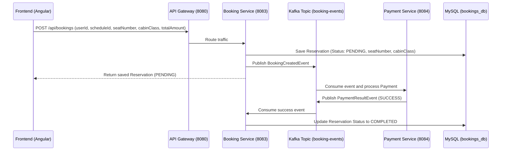

# Especificación Técnica de Implementación: Flight Seat Map & Selection — SkyLink GDS

Este documento describe de forma exhaustiva la arquitectura, el modelo de datos, la integración entre servicios a través del API Gateway y Kafka, y la interfaz de usuario interactiva del módulo de **Mapa de Asientos y Reservas (Flight Seat Map & Selection)** implementado en el Frontend Angular y el backend `booking-service` de SkyLink GDS.

---

## 1. Introducción y Propósito de la Feature

El módulo de **Flight Seat Map & Selection** permite a los agentes de viajes de SkyLink GDS visualizar la distribución física de asientos en tiempo real, comprobar qué asientos están ocupados o disponibles por cabina y procesar reservas directas asignando un asiento específico al pasajero.

### Objetivos Principales:
* **Mapa Interactivo Multiclase:** Mostrar una silueta completa de un Boeing 787-9 Dreamliner con las cuatro clases comerciales: *First Class*, *Business Class*, *Premium Economy* y *Economy Class*.
* **Persistencia de Asignación de Asientos:** Asegurar que cada reserva tenga asociado un asiento físico (`seatNumber`) y una cabina de vuelo (`cabinClass`) correspondiente.
* **Integración en Tiempo Real con el Backend:** Consultar las reservas activas de un vuelo para bloquear los asientos ocupados antes de renderizar el mapa interactivo.
* **Sincronización con el Dashboard de Administración:** Reflejar de inmediato las ventas del asiento en los KPIs globales y la tabla de transacciones del administrador.

---

## 2. Arquitectura del Backend: Cambios en `booking-service`

El microservicio `booking-service` (puerto `8083`) gestiona el ciclo de vida de las reservas. Se implementaron modificaciones a nivel de persistencia, lógica de negocio y controladores REST.

### 2.1 Modelo de Datos (`Reservation.java`)
Se añadieron campos específicos para representar la asignación física del asiento dentro de la entidad JPA:

```java
@Entity
@Table(name = "reservations")
@Data
@NoArgsConstructor
@AllArgsConstructor
@Builder
public class Reservation {
    // ...
    @Column(nullable = true, length = 4)
    private String seatNumber; // Ej: "14A", "2B"

    @Column(nullable = true, length = 20)
    private String cabinClass; // Ej: "FIRST", "BUSINESS", "PREMIUM_ECONOMY", "ECONOMY"
    // ...
}
```

* **Actualización del Esquema:** Gracias a la configuración centralizada de Spring Cloud en `booking-service.yaml`, la base de datos MySQL (`bookings_db`) añade automáticamente estas columnas en el arranque inicial utilizando `spring.jpa.hibernate.ddl-auto: update`.

### 2.2 Repositorio de Persistencia (`ReservationRepository.java`)
Se añadió una consulta JPQL personalizada para obtener únicamente las reservas activas (excluyendo estados de cancelación y fallo) asociadas a un vuelo:

```java
@Query("SELECT r FROM Reservation r WHERE r.scheduleId = :scheduleId AND r.status IN (com.gds.airline.booking_service.model.PaymentStatus.PENDING, com.gds.airline.booking_service.model.PaymentStatus.COMPLETED)")
List<Reservation> findActiveReservationsByScheduleId(@Param("scheduleId") Long scheduleId);
```

### 2.3 Controlador REST y DTOs (`BookingController.java`)
Se implementó un nuevo endpoint para exponer los asientos bloqueados y ocupados al frontend:
* **Endpoint:** `GET /api/bookings/flight/{flightId}/seats`
* **Respuesta:** Lista de objetos `SeatMapResponse` (record Java 21) que contiene únicamente el identificador del asiento, su clase y estado de reserva, resguardando la privacidad de los pasajeros.

---

## 3. Arquitectura del Frontend: Componente de Mapa de Asientos (Angular 21)

El módulo visual se estructuró siguiendo los estándares del proyecto (componentes standalone, SCSS semántico con BEM y uso de la función `inject()`).

### 3.1 Componente Standalone `FlightSeatMapModal`
Ubicado en `src/app/pages/flights/flight-seat-map-modal/`.
* **Plantilla (`flight-seat-map-modal.html`):** Incorpora un plano aéreo del avión. Las alas se representaron simétricamente en el fuselaje (el ala izquierda se dibuja apuntando hacia atrás e izquierda sin utilizar transformaciones CSS que afecten su dirección).
* **Control de Flujo Angular Moderno:** Hace uso de `@for` para iterar sobre la estructura de cabinas y filas de manera altamente eficiente.
* **Scrollbar y Estilo de Alturas Optimizado (`flight-seat-map-modal.scss`):** Se configuró la tarjeta de detalles con `flex: 0 0 auto` en lugar de `flex: 1`, permitiendo que la tarjeta de estadísticas del vuelo (`.stats-card`) ascienda en el layout y sea visible directamente en pantalla sin necesidad de scroll vertical en el panel lateral.

---

## 4. Flujo del Evento de Reserva (Saga Kafka)

Al seleccionar un asiento y pulsar "Reserve Seat", se inicia el siguiente flujo de microservicios:



1. El frontend envía los detalles de asignación del asiento al Gateway.
2. `booking-service` guarda la reserva con estado inicial `PENDING` y publica el evento en Kafka.
3. El microservicio de pagos (`payment-service`) procesa de manera asíncrona la simulación de cobro y publica el éxito del pago.
4. `booking-service` consume la confirmación del pago y actualiza la reserva a `COMPLETED`.
5. El panel de control (Dashboard) y los listados analíticos muestran instantáneamente la transacción y reajustan los KPI de recaudación.

---

## 5. Instrucciones de Ejecución y Verificación

### Compilación del Backend con JDK 21:
Para prevenir errores de compatibilidad del preprocesador de Lombok con compiladores experimentales, es imperativo compilar y empaquetar utilizando **Java 21** (`ms-21.0.11`):

```powershell
# Desde el directorio raíz del microservicio
$env:JAVA_HOME="C:\Users\Anton\.jdks\ms-21.0.11"
mvn clean package -DskipTests
```

### Ejecución de Servicios:
1. Levantar la infraestructura Docker (MySQL, Redis, Kafka, Zipkin).
2. Arrancar los microservicios en orden (Config Server, Eureka, Gateway, Auth Service y Booking Service).
3. Iniciar el frontend Angular: `npm start`.
