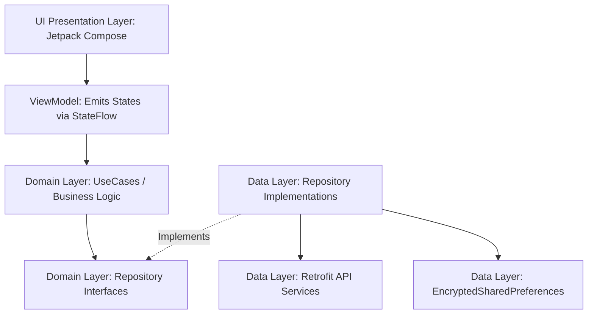

# SkyLink GDS — Passenger Android Application Guide

This document contains the official architecture, feature list, dependency overview, and technical decisions implemented in the native Kotlin Passenger Android application for **SkyLink GDS**.

---

## 1. Project Overview

The SkyLink Android application is a native passenger client designed to search flights, manage bookings, check in, and view travel itineraries. It interfaces directly with the central Spring Boot API Gateway at port `8080` and complements the Angular Admin Dashboard.

---

## 2. Technical Stack & Key Constraints

* **Core Language:** Kotlin 2.2.10
* **UI Toolkit:** Jetpack Compose (100% Declarative UI, no XML layouts/views)
* **Architecture:** MVVM (Model-View-ViewModel) + Clean Architecture
* **Asynchronous Flow:** Kotlin Coroutines & StateFlow (no deprecated LiveData)
* **Dependency Injection:** Dagger Hilt
* **Networking:** Retrofit 2 + OkHttp 4 + Moshi (JSON serialization)
* **Secure Storage:** Jetpack Security (EncryptedSharedPreferences)
* **Image Loading:** Coil (Coroutines Image Loader)

---

## 3. Project Architecture

The application is built using a strict layer-decoupling model to isolate business logic from UI frameworks and framework-level data sources.



### Layer Breakdown

#### A. Presentation Layer (`ui/` and `features/.../presentation/`)
- Contains `@Composable` screens (`LoginScreen.kt`, `HomeScreen.kt`) that react to UI state.
- ViewModels (`AuthViewModel.kt`) inherit Hilt lifecycle components via `@HiltViewModel`. They fetch inputs, launch coroutine jobs, and modify private `MutableStateFlow`s, exposing immutable `StateFlow`s to Compose via `collectAsState()`.

#### B. Domain Layer (`features/.../domain/`)
- Houses UseCases (`LoginUseCase.kt`) containing pure business logic rules.
- Contains repository interfaces (`AuthRepository.kt`) defining contracts for data fetching. This layer has zero dependencies on external frameworks (Retrofit, Android components, etc.).

#### C. Data Layer (`features/.../data/`)
- Implements repository interfaces (`AuthRepositoryImpl.kt`).
- Handles Retrofit service APIs (`AuthApi.kt`), data models/entities (`LoginRequest.kt`, `LoginResponse.kt`), and database/cache transactions.

---

## 4. Key Configurations & Integrations

### 1. Emulator Base URL Routing (`10.0.2.2`)
To communicate with the Spring Boot API Gateway running on the development host computer, the app uses the Retrofit configuration:
- **Base URL:** `http://10.0.2.2:8080/`
- *Note:* `127.0.0.1` or `localhost` is forbidden in code as the Android emulator maps these addresses to its own internal loopback interface, failing to connect to the backend gateway.

### 2. Network Token Injection (`AuthInterceptor`)
A custom OkHttp `Interceptor` (`AuthInterceptor.kt`) intercepts all outgoing HTTP requests to the backend:
- Dynamically checks if a JWT token is stored.
- Injects `Authorization: Bearer <TOKEN>` in the headers.
- Automatically skips authentication headers for authentication routes (e.g. `/api/auth/login`).

### 3. Secure Hardware-Backed Storage (`StorageModule`)
User tokens and session credentials cannot be stored in plain text. The application uses Android's Keystore system:
- Configures `EncryptedSharedPreferences` with `AES256_GCM` value encryption and `AES256_SIV` key encryption.
- Keeps authentication sessions secure against unauthorized reads on rooted devices.

### 4. Custom Downloadable Typography (`Plus Jakarta Sans`)
The design system defines `Plus Jakarta Sans` as the default font family. To bypass APK size overhead and cache fonts system-wide:
- Implemented **Downloadable Fonts** via Google Fonts Provider in `Type.kt`.
- Created `font_certs.xml` containing official Base64 development and production certificate hashes. This prevents security failures during Play Services certificate verification.

---

## 5. Main App Features & Screens

### A. Authentication Feature (`features/auth/`)
- **Login Screen:** Matches the Stitch design system. Features Material Design 3 filled text fields with floating animatable labels, standard `16.dp` corner radius inputs, a primary login button, and branded vector icons for Google and Apple social sign-ins.

### B. Home & Explore Feature (`features/home/`)
- **TopAppBar:** Custom sticky navigation header displaying brand logos and profile shortcuts.
- **Hero Header:** A coastline image loaded dynamically via Coil with a custom vertical gradient overlay.
- **Bento Search Card:** Holds Trip type toggles, full-width fields for Origin, Destination, Dates, and Travelers, and a centered airport swap action button.
- **Bento Quick Links Grid:** A 2x2 modular grid representing Check-In, Manage Trip, Flight Status, and Help Center services.
- **Explore Carousel:** A horizontal scroll holding flight cards with pricing overlays and semantic gradient tints (sage green, periwinkle, olive gold).
- **Mobile Bottom Navigation:** Fixed bottom navigation bar supporting quick switching between Search, My Trips, Alerts, and Profile.

---

## 6. Gradle Dependencies Breakdown (`app/build.gradle.kts`)

Here are the key libraries implemented in the project and their technical purposes:

| Dependency group | Library | Purpose |
|---|---|---|
| **Compose Core** | `androidx.compose.ui:ui` & `ui-graphics` | Main UI elements and vector rendering. |
| **Material 3** | `androidx.compose.material3:material3` | Material You color themes, buttons, cards, and input text fields. |
| **Material Icons** | `material-icons-extended` | Provides Extended vector icon sets like `Luggage`, `AirplaneTicket`, and `SupportAgent`. |
| **Coil** | `io.coil-kt:coil-compose` | Performs asynchronous image loading from URLs. |
| **Google Fonts** | `ui-text-google-fonts` | Dynamically downloads custom fonts (`Plus Jakarta Sans`) at runtime. |
| **Hilt DI** | `hilt-android` & `hilt-compiler` | Manages automatic dependency injection. |
| **Hilt Compose** | `hilt-navigation-compose` | Scopes ViewModels to navigation graph nodes. |
| **Retrofit** | `retrofit` & `converter-moshi` | HTTP REST client. Converts network payloads into Kotlin objects. |
| **Moshi** | `moshi-kotlin` | Safe Kotlin JSON parser and serializer. |
| **Navigation** | `navigation-compose` | Directs Jetpack Compose screen-to-screen navigation routing. |
| **Security** | `security-crypto` | Implements hardware-backed secure `EncryptedSharedPreferences`. |

---

## 7. Build, Build Environment & Run Commands

### Gradle Build Custom JDK Routing
If Gradle fails to locate a valid `jlink` executable or uses an incorrect JDK version, you must force it to use Android Studio's bundled **JetBrains Runtime (JBR)**.

#### 1. Stop active Gradle Daemons:
```powershell
./gradlew --stop
```

#### 2. Compile and install on the emulator with JBR JAVA_HOME:
```powershell
$env:JAVA_HOME="C:\Program Files\Android\Android Studio\jbr"
./gradlew installDebug
```

#### 3. Launch the Main Activity on the emulator via ADB:
```powershell
& "C:\Users\Anton\AppData\Local\Android\Sdk\platform-tools\adb.exe" shell am start -n com.alalodev.skylink/com.alalodev.skylink.MainActivity
```
