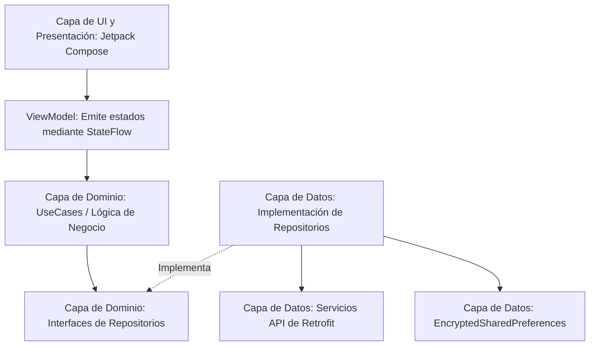

# Guía del Proyecto Mobile — Aplicación Android de Pasajeros de SkyLink GDS

Este documento contiene la guía oficial de arquitectura, características, dependencias y decisiones técnicas implementadas en la aplicación móvil nativa en Kotlin para pasajeros de **SkyLink GDS**.

---

## 1. Descripción General del Proyecto

La aplicación Android de SkyLink es un cliente de pasajeros nativo diseñado para buscar vuelos, gestionar reservas, realizar el check-in y visualizar itinerarios de viaje. Se conecta directamente con el API Gateway de Spring Boot en el puerto `8080` y complementa el Panel de Administración de Angular.

---

## 2. Stack Tecnológico y Restricciones Clave

* **Lenguaje Principal:** Kotlin 2.2.10
* **Toolkit de UI:** Jetpack Compose (UI 100% Declarativa, sin layouts XML heredados)
* **Arquitectura:** MVVM (Model-View-ViewModel) + Clean Architecture
* **Flujo Asíncrono:** Kotlin Coroutines & StateFlow (sin el obsoleto LiveData)
* **Inyección de Dependencias:** Dagger Hilt
* **Redes:** Retrofit 2 + OkHttp 4 + Moshi (serialización JSON)
* **Almacenamiento Seguro:** Jetpack Security (EncryptedSharedPreferences)
* **Carga de Imágenes:** Coil (Cargador de Imágenes optimizado con Corrutinas)

---

## 3. Arquitectura del Proyecto

La aplicación está construida utilizando un modelo de desacoplamiento estricto por capas para aislar la lógica de negocio de los frameworks de UI y de las fuentes de datos externas.



### Desglose de Capas

#### A. Capa de Presentación (UI) (`ui/` y `features/.../presentation/`)
- Contiene pantallas `@Composable` (`LoginScreen.kt`, `HomeScreen.kt`) que reaccionan al estado de la interfaz de usuario.
- Los ViewModels (`AuthViewModel.kt`) heredan los componentes de ciclo de vida de Hilt mediante la anotación `@HiltViewModel`. Reciben entradas de usuario, lanzan corrutinas y actualizan un `MutableStateFlow` privado, exponiendo un `StateFlow` inmutable a Compose a través de `collectAsState()`.

#### B. Capa de Dominio (`features/.../domain/`)
- Aloja los casos de uso (`LoginUseCase.kt`) que contienen las reglas puras de la lógica de negocio móvil.
- Contiene las interfaces de los repositorios (`AuthRepository.kt`) que definen los contratos para la obtención de datos. Esta capa tiene cero dependencias de frameworks externos (Retrofit, librerías de Android, etc.).

#### C. Capa de Datos (`features/.../data/`)
- Implementa las interfaces de los repositorios (`AuthRepositoryImpl.kt`).
- Gestiona las llamadas de red mediante Retrofit (`AuthApi.kt`), los modelos/entidades de serialización (`LoginRequest.kt`, `LoginResponse.kt`), y el acceso al almacenamiento local (SharedPreferences).

---

## 4. Configuraciones Clave e Integraciones

### 1. URL Base para el Emulador (`10.0.2.2`)
Para comunicarse con el API Gateway de Spring Boot que se ejecuta en el host de desarrollo, la aplicación utiliza la configuración de Retrofit:
- **Base URL:** `http://10.0.2.2:8080/`
- *Nota:* Queda prohibido usar `127.0.0.1` o `localhost` en el código, ya que el emulador de Android mapea estas direcciones a su propia interfaz de red loopback interna, fallando en conectar con la máquina host.

### 2. Inyección Automática de Tokens (`AuthInterceptor`)
Un `Interceptor` personalizado de OkHttp (`AuthInterceptor.kt`) intercepta todas las peticiones salientes hacia el backend:
- Comprueba dinámicamente si hay un token JWT almacenado.
- Inyecta la cabecera `Authorization: Bearer <TOKEN>`.
- Omite automáticamente las cabeceras de autorización en las rutas públicas de autenticación (como `/api/auth/login`).

### 3. Almacenamiento Seguro Encriptado por Hardware (`StorageModule`)
El token de usuario y las credenciales de sesión no pueden guardarse en texto plano. La aplicación utiliza el almacén de claves (Keystore) de Android:
- Configura `EncryptedSharedPreferences` con encriptación de valores `AES256_GCM` y de claves `AES256_SIV`.
- Mantiene la sesión segura frente a lecturas no autorizadas en dispositivos con acceso root.

### 4. Fuentes Descargables Personalizadas (`Plus Jakarta Sans`)
El diseño del sistema define `Plus Jakarta Sans` como la tipografía por defecto. Para evitar sobrecargar el tamaño del APK:
- Implementamos **Fuentes Descargables** mediante Google Fonts en `Type.kt`.
- Creamos `font_certs.xml` con los hashes oficiales Base64 para desarrollo y producción de Google Fonts, lo que evita fallos de firma al descargar la fuente en los dispositivos.

---

## 5. Características Principales e Interfaces Implementadas

### A. Módulo de Autenticación (`features/auth/`)
- **Pantalla de Login:** Fiel al diseño de Stitch. Cuenta con campos de texto MD3 llenos (Filled) con etiquetas flotantes animadas, esquinas superiores redondeadas de `16.dp`, un botón principal de inicio de sesión y botones sociales elegantes para Google y Apple que usan drawables vectoriales nativos.

### B. Módulo Home ("Buscar y Explorar Vuelos") (`features/home/`)
- **TopAppBar:** Cabecera de navegación personalizada con el logo de la aerolínea, título y acceso rápido al perfil de usuario.
- **Sección Hero:** Un contenedor superior con imagen costera cargada asíncronamente mediante Coil y un degradado de superposición vertical.
- **Bento Search Card:** Incluye selectores de viaje de ida/vuelta, campos a ancho completo para Origen, Destino, Fechas e Invitados (Travelers) alineados en filas individuales, y un botón de intercambio de aeropuertos en el centro.
- **Bento Quick Services:** Cuadrícula de servicios 2x2 para acceder de manera directa a *Manage Trip*, *Check-In*, *Flight Status* y *Help Center*.
- **Explore Carousel:** Un carrusel horizontal con tarjetas de vuelos que muestran tarifas de ofertas especiales y degradados semánticos de marca (sage green, periwinkle y gold).
- **Barra de Navegación Inferior:** Menú fijo de pestañas rápido para Search, My Trips, Alerts y Profile.

---

## 6. Desglose de Dependencias de Gradle (`app/build.gradle.kts`)

Aquí se detallan las librerías del sistema y sus propósitos técnicos:

| Grupo de Dependencia | Librería | Propósito |
|---|---|---|
| **Compose Core** | `androidx.compose.ui:ui` & `ui-graphics` | Elementos de UI y renderizado vectorial principal. |
| **Material 3** | `androidx.compose.material3:material3` | Temas de color de Material You, botones, tarjetas y campos de texto. |
| **Iconos de Material** | `material-icons-extended` | Proporciona iconos vectoriales extendidos como `Luggage`, `AirplaneTicket` y `SupportAgent`. |
| **Coil** | `io.coil-kt:coil-compose` | Permite la carga asíncrona de imágenes de red a partir de URLs. |
| **Google Fonts** | `ui-text-google-fonts` | Descarga de forma dinámica la fuente tipográfica (`Plus Jakarta Sans`) en tiempo de ejecución. |
| **Hilt DI** | `hilt-android` & `hilt-compiler` | Gobierno e inyección de dependencias estricta. |
| **Hilt Compose** | `hilt-navigation-compose` | Acopla y limita los ViewModels al ciclo de vida de la navegación Compose. |
| **Retrofit** | `retrofit` & `converter-moshi` | Cliente REST HTTP para consumir la API del Gateway y mapearla a objetos Kotlin. |
| **Moshi** | `moshi-kotlin` | Convertidor JSON a clases Kotlin rápido y seguro. |
| **Navegación** | `navigation-compose` | Gestiona el enrutamiento de pantallas en Jetpack Compose. |
| **Seguridad** | `security-crypto` | Implementa el almacenamiento encriptado seguro (`EncryptedSharedPreferences`). |

---

## 7. Entorno de Compilación y Comandos para Ejecutar

### Compilación Personalizada de Gradle usando JDK JBR
Si Gradle falla al compilar por no encontrar el binario de `jlink` en la ruta antigua del IDE, se debe forzar el uso del **JetBrains Runtime (JBR)** integrado en Android Studio.

#### 1. Detener los Daemons activos de Gradle:
```powershell
./gradlew --stop
```

#### 2. Compilar e instalar la aplicación debug forzando el JAVA_HOME de JBR:
```powershell
$env:JAVA_HOME="C:\Program Files\Android\Android Studio\jbr"
./gradlew installDebug
```

#### 3. Iniciar la actividad principal en el emulador mediante ADB:
```powershell
& "C:\Users\Anton\AppData\Local\Android\Sdk\platform-tools\adb.exe" shell am start -n com.alalodev.skylink/com.alalodev.skylink.MainActivity
```
